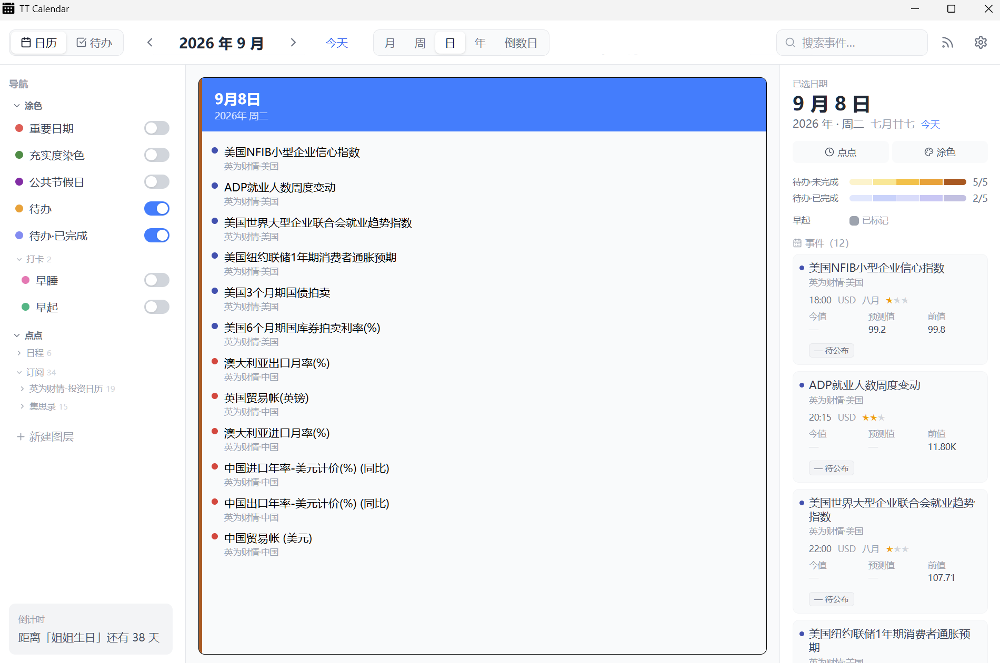
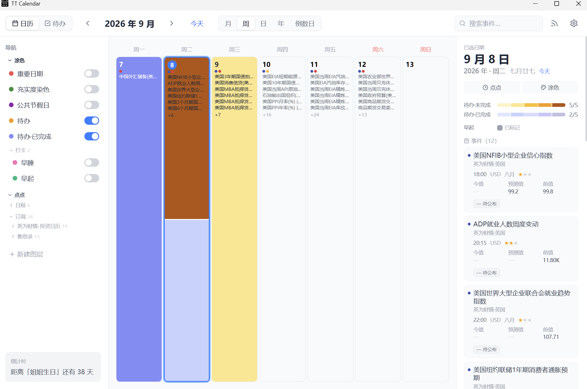
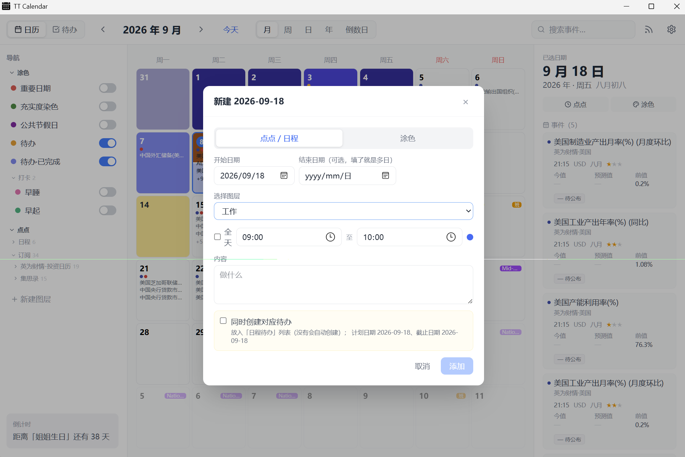
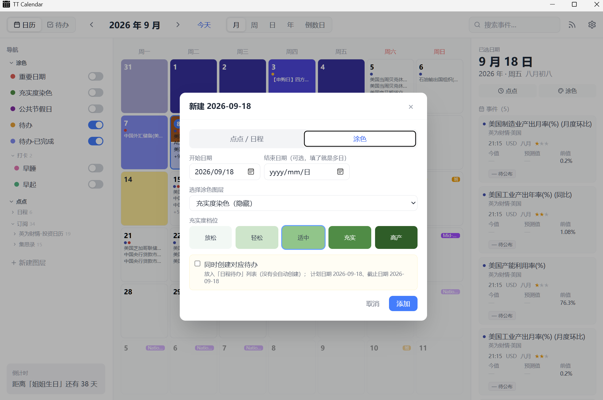
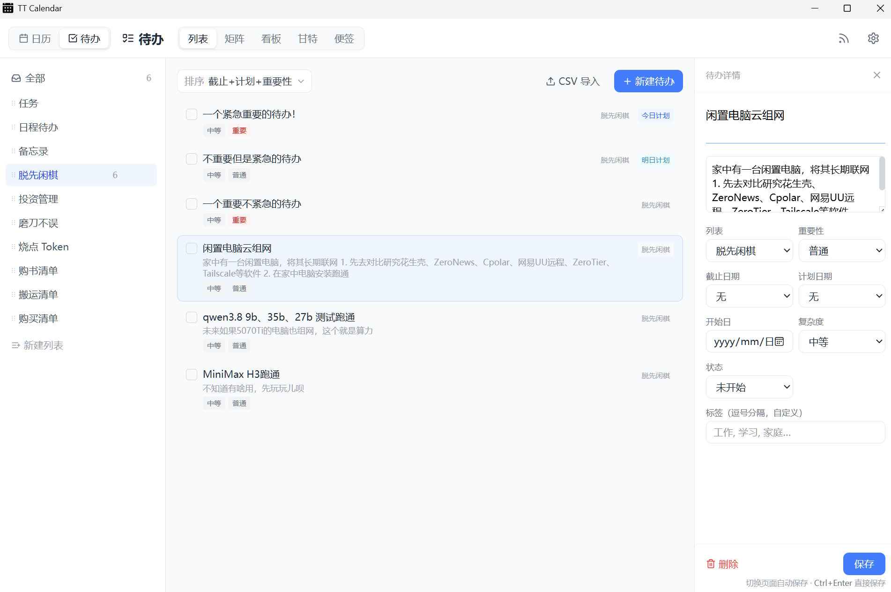
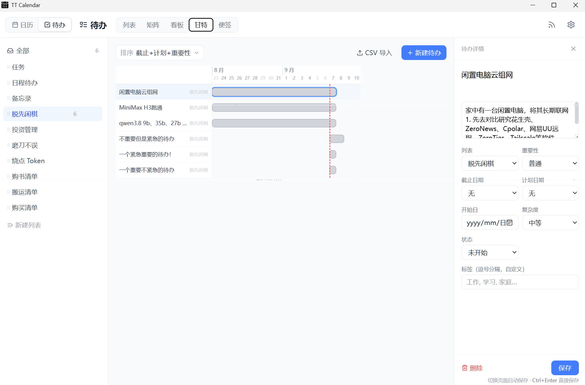
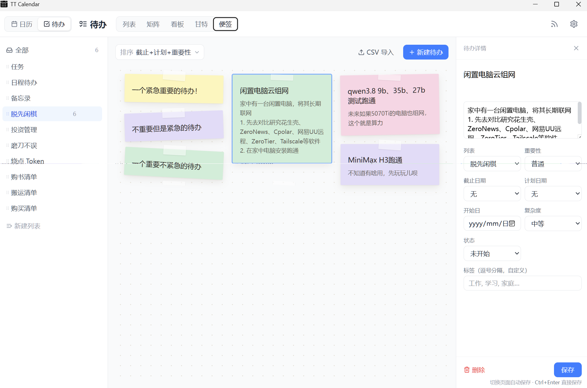
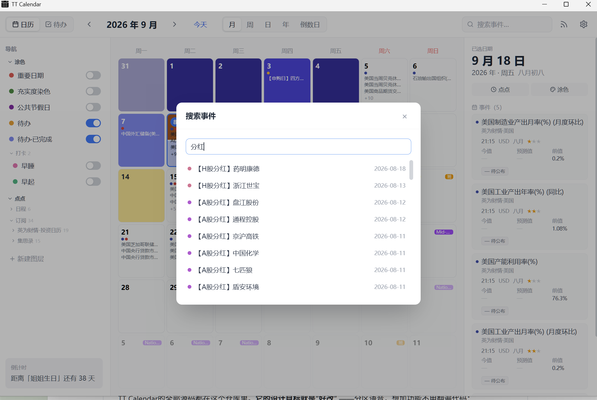
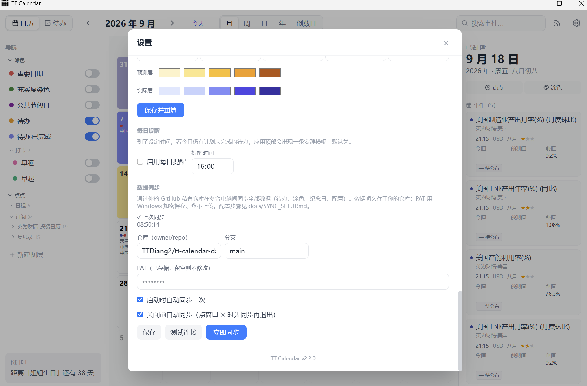

<div align="center">

# 🗓️ TT Calendar

**你的日程，你的规则。** 本地优先的桌面日历 + 待办 + 倒计时 —— 不注册、不联网、不交会员费。

**[English](README.md) · 简体中文**

[](https://github.com/TTDiang2/TT_Calendar/releases)
[]()
[]()

> 下载、解压、双击即用 —— **不需要装 Python**，不需要注册，不需要任何配置。

</div>

---

## 为什么会有这个项目

市面上的日历 / 待办应用，总有一百个地方让你不爽：想按自己的方式记日程？没有。
想要某个特殊的日子自动倒计时？会员。想看一周的日程密度再决定怎么安排？没有这个视图。
数据不在自己手里？更别说了。

TT Calendar 反过来做 —— **你的规则优先，而且 100% 可改**。
全部源码都在这个仓库里，交给任何 AI 编程助手，一句话就能加功能。

---

## ✨ 亮点一览

- 🗓️ **四种日历视图** —— 月 / 周 / 日 / 年，支持拖拽整体改期
- 🧩 **模块化订阅插件**（v2.3 新特性）—— 想订阅什么日历就订阅什么日历：经济日历、市场数据、节假日……插件**互通共享**，社区里找得到就拿来用，找不到就自己做一个分享出去。详见下文。
- 📝 **三段式日程** —— 一天就分「上午 / 下午 / 晚上」，不搞花里胡哨的复杂表单
- 🎨 **充实度染色** —— 每天按日程多少染成深浅不同的绿色，一眼看出哪天被塞满、哪天是空的
- ✅ **待办五种视图** —— 列表 / 矩阵 / 看板 / 甘特 / 便签，按「截止日期 × 重要度」排序
- ⏳ **纪念日倒计时** —— 标记一次，自动生成 99 / 100 / 365 / 520 / 1000 天…的倒计时
- 🌔 **农历支持** —— 内置农历与节气
- 🔍 **全局搜索** —— 一个按键跳转任意日期
- 📥 **数据图层** —— 中国节假日、投资日历、自定义事件，侧边栏一键开关
- 🔐 **数据 100% 本地** —— SQLite 存在你自己机器上，谁也拿不走

---

## 🧩 订阅插件：想订阅什么日历，就订阅什么日历

*(v2.3 引入 —— 一个"开放订阅"的插件生态)*

一个订阅源 = 一个**插件**：单个 Python 文件，描述"抓什么"和"怎么展示"。
插件**不随 TT Calendar 主程序捆绑发布**，而是放在专门的**插件仓库**里，
按需安装到本地 —— 要什么日历就装什么日历。

### 📦 插件仓库：[TTDiang2/TT_Calendar_Plugins](https://github.com/TTDiang2/TT_Calendar_Plugins)

在仓库里挑你需要的日历源 —— **英为财情经济日历、集思录投资日历**，以及社区后续贡献的更多插件。

### 安装一个插件（三步）

1. 从插件仓库下载插件 `.py` 文件（例如 `investing.py`）
2. 放进应用的 `plugins/` 文件夹：

   ```
   TT_Calendar/
   └── plugins/
       └── investing.py     # ← 从插件仓库下载来的
   ```

   （打包版 exe：在 exe 旁边新建一个 `plugins/` 文件夹放进去即可。）

3. 重启应用 —— 侧边栏出现对应图层，订阅面板里就能添加这个数据源了

### 自己写 & 分享

- **按需订阅** —— 经济日历、市场事件、假期……你的工作流关心什么就订阅什么
- **自己写只需 ~100 行** —— 拉事件 → 声明图层 → 声明字段展示。不改核心代码、不用写前端
- **分享出去** —— 给插件仓库提 PR，别人就不用重复造轮子了

完整协议见 **[订阅插件开发指南](docs/SUBSCRIPTION_PLUGIN_GUIDE.md)**。

---

## 📸 截图

### 日历视图

| 月视图 · 充实度染色 | 月视图 · 当天待办自动展示在右侧边栏 |
|---|---|
|  |  |

| 月视图 · 待办染色 | 日视图 |
|---|---|
|  |  |

| 周视图 | 年视图 · 充实度染色 |
|---|---|
|  |  |

### 新建与涂色

| 新建日程弹窗 | 涂色弹窗 |
|---|---|
|  |  |

### 待办 —— 五种看法

| 列表 | 矩阵 |
|---|---|
|  |  |

| 看板 | 甘特 |
|---|---|
|  |  |

| 便签 |
|---|
|  |

### 倒计时与搜索

| 倒计时卡片 | 事件搜索 |
|---|---|
|  |  |

### 订阅（插件）与数据同步

| 创建订阅 | 设置 · GitHub 数据同步 |
|---|---|
|  |  |

---

## ⚡ 立即使用

### 直接下载（推荐）

前往 **[GitHub Releases](https://github.com/TTDiang2/TT_Calendar/releases)** 下载最新版本，共 3 个文件：

| 文件 | 作用 |
|---|---|
| `TT-Calendar-Launcher-x64.exe` | 启动器 —— 双击它就行 |
| `TT-Calendar-x64.exe` | 日历界面（Tauri 桌面端） |
| `tt-calendar-backend-x64.exe` | 后端服务（已内置 Python 运行时） |

**使用方法**：三个文件放进同一个文件夹，双击 `TT-Calendar-Launcher-x64.exe`，等 5~10 秒窗口打开即用。

> ✅ **不需要安装 Python** —— 后端 exe 已内置完整 Python 运行时，开箱即用。
> ✅ 不需要注册、不强制联网、不需要任何配置。

### 从源码运行（开发模式）

```bash
pip install -r requirements.txt
uvicorn backend.main:app --reload --port 8000
```

```bash
cd frontend
npm install
npm run dev
```

浏览器打开 http://localhost:5173，或 `npm run tauri:dev` 打开桌面窗口。

---

## 🖱️ 上手体验

| 操作 | 效果 |
|---|---|
| **双击**任意日期 | 新建日程事件 |
| **右键**任意日期 | 快捷菜单：新建事件 / 设置日程 / 设置染色 |
| **拖拽**日期格子 | 把这一天的安排整体移到另一天 |
| **← / →** | 切换上/下月（周/日视图为上周/下周） |
| **T** | 跳回今天 |
| **N** | 在选中日期快速新建事件 |
| **/** | 全局搜索，回车跳转 |
| **侧边栏图层开关** | 一键显示/隐藏数据图层 |

### 侧边栏数据图层

不想要的信息，关掉即可；想要更多，打开即可：

- **中国节假日**：法定节假日与调休，自动标注
- **投资日历**：新股、可转债、分红、REITs、股指期权等事件，按需拉取
- **充实度染色**：五档绿色直观呈现每天的日程密度
- **重要日期图层**：手动标记的特殊日子，带倒计时

---

## 🏗️ 架构一览

```
TT-Calendar-Launcher.exe (Rust)
        │ 拉起后端 + 健康检查 + 生命周期管理
        ▼
tt-calendar-backend.exe (FastAPI · 内嵌 Python · 127.0.0.1:8765)
        │ REST API
        ▼
TT Calendar.exe (Tauri + React · 界面)
```

| 层 | 技术 |
|---|---|
| 界面 | React · TypeScript · Tailwind CSS · Tauri 2 |
| 后端 | FastAPI · SQLite |
| 启动器 | Rust（进程编排） |
| 插件 | Python `Source` 协议，`plugins/` 目录自动发现 |

深入阅读：[架构](docs/ARCHITECTURE.md) · [设计哲学](docs/PHILOSOPHY.md) ·
[插件开发指南](docs/SUBSCRIPTION_PLUGIN_GUIDE.md) · [同步协议](docs/SYNC_PROTOCOL.md)

---

## 🔒 数据与隐私

- 所有数据（日程、待办、配置）存储在应用目录下的 `data/calendar.db`（SQLite）
- 无账号体系、无遥测、无任何网络上报
- 外部数据图层仅在打开时按需拉取
- 数据目录被 `.gitignore` 排除，个人数据不会进入版本库

---

## 🛠️ 为"好改"而生

设计目标就是 **"不满意就改源码"** —— 模块边界清晰，大多数功能只碰一两个文件：

```
├── frontend/            # 界面（React + Tauri）
├── backend/             # 后端 API（FastAPI）
├── tt_calendar/         # 核心业务逻辑（Python）
├── plugins/             # 本地安装的订阅插件（从 TT_Calendar_Plugins 插件仓库获取）
├── launcher/            # 启动器（Rust）
├── scripts/             # 辅助脚本
└── tests/               # 自动化测试
```

**想加功能？** 直接把需求告诉你的 AI 助手，例如：

> "给 TT Calendar 加一个农历节气显示，放在月视图侧边栏"
> "待办支持重复任务，每周一自动生成"
> "把某个日历源做成订阅插件"

**想重新发布？** 运行一键构建：

```bat
build_release.bat
```

依次构建前端、桌面端、后端、启动器，产出 3 个 exe 到 `release/` —— 直接分发给任何 Windows 电脑，对方不需要装任何环境。

---

## 🤝 参与贡献

- 发现 bug 或想要新功能？开个 [issue](../../issues)
- 写了好用的订阅插件？**分享出来** —— 插件只有一个文件，见 [插件开发指南](docs/SUBSCRIPTION_PLUGIN_GUIDE.md)
- 文档与代码同仓，见 `docs/`

---

## 📄 许可证

MIT License —— 随便用，保留署名即可。
